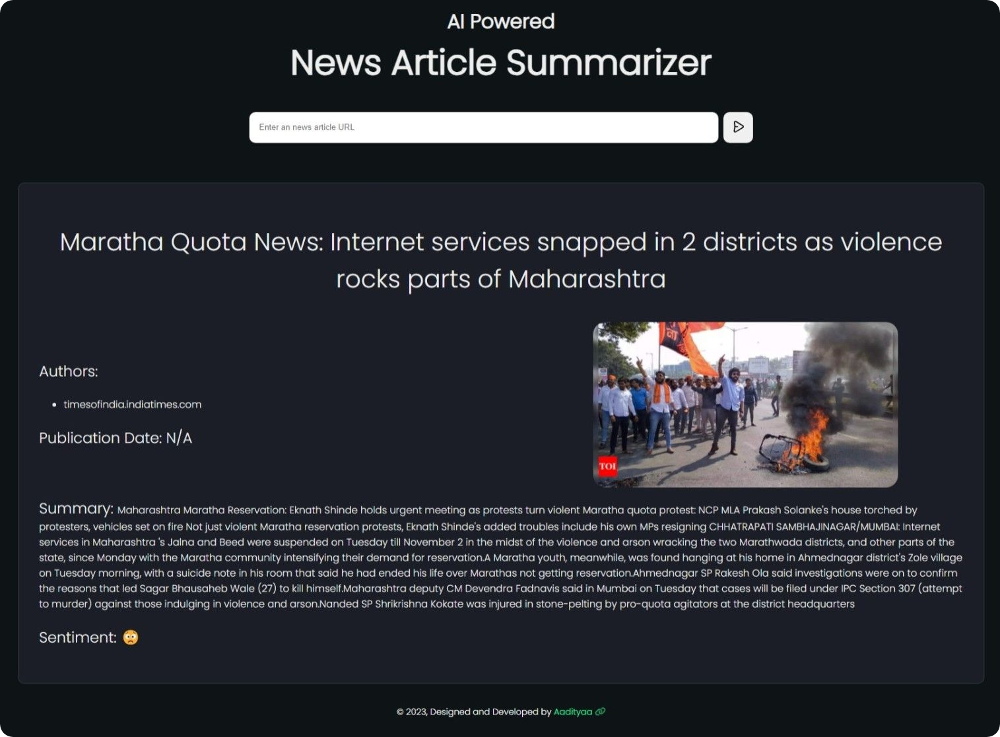

# Ai-News-Summarizer-Language-Converter
# 📰 AI News Summariser

AI News Summariser is a Flask-based web application that allows users to extract, summarize, translate, and listen to news articles from any valid URL. It uses powerful NLP and TTS tools including **TextBlob**, **Newspaper3k**, **Google Translate**, and **pyttsx3**.

---

## 🌟 Features

- 🔍 **URL-based News Extraction** using Newspaper3k
- ✂️ **Text Summarization** with NLTK and TextBlob
- 🌐 **Multilingual Translation** with Google Translate API
- 🔊 **Text-to-Speech Output** using `pyttsx3`
- 🌍 **Language Selection** (e.g., Hindi, English)
- 💡 Clean UI for input and output display

---

## 📸 Screenshot



---

## 🛠️ Technologies Used

| Area             | Tools/Packages                         |
|------------------|----------------------------------------|
| Web Framework    | Flask                                  |
| NLP & Summarization | TextBlob, NLTK, Newspaper3k        |
| Translation      | googletrans                            |
| TTS (Text-to-Speech) | pyttsx3                          |
| Validation       | validators                             |
| HTML Templates   | Flask Jinja2 templating                 |

---

## 📁 Project Structure

AI-News-Summariser/
├── app.py # Main Flask application
├── tts_output.py # TTS using pyttsx3
├── templates/
│ └── index.html # UI for user input/output
├── static/ # (Optional) for CSS/images
├── image.png # UI screenshot
├── requirements.txt # Dependency list
└── README.md # Project overview


---

## ⚙️ Installation

1. **Clone the repository**
```bash
git clone https://github.com/yourusername/AI-News-Summariser.git
cd AI-News-Summariser


2.Create a virtual environment (optional but recommended)
python -m venv venv
source venv/bin/activate    # On Windows: venv\Scripts\activate


3.Install dependencies
pip install -r requirements.txt

If requirements.txt doesn't exist, manually install:
pip install flask pyttsx3 googletrans==4.0.0-rc1 newspaper3k nltk textblob validators

4.Download NLTK Data
>>> import nltk
>>> nltk.download('punkt')


Running the App
python app.py


📌 How It Works
User Inputs a news article URL and selects the language.

Article Content is extracted using newspaper3k.

Summarization is performed using TextBlob & NLTK.

Translation (if needed) via Google Translate.

Speech Output using pyttsx3 for TTS.

🧠 Example Use Case
Input: https://www.bbc.com/news/technology-123456

Language: Hindi

Output:

Extracted summary in Hindi

Read aloud using TTS


🧪 Testing
Test URL validation

Try various languages

Try invalid or paywalled URLs (some may fail to extract)

Test TTS output with long text


🚀 Deployment Tips
Use Gunicorn + Nginx for production (Flask)

Add Docker support for easy containerization

Use Streamlit for simpler deployment if preferred


📜 License
This project is licensed under the MIT License.


🤝 Contributing
Contributions are welcome! Feel free to open issues or submit PRs to improve summarization, UI, or language support.

🙋‍♂️ Author
Developed by Mukeem Akhatr

